# 実践 AWSデータサイエンス ハンズオンワークショップ

[Data Science on AWS本家のワークショップコンテンツ](https://github.com/data-science-on-aws/workshop)の日本語翻訳版です。

### 本書の概要

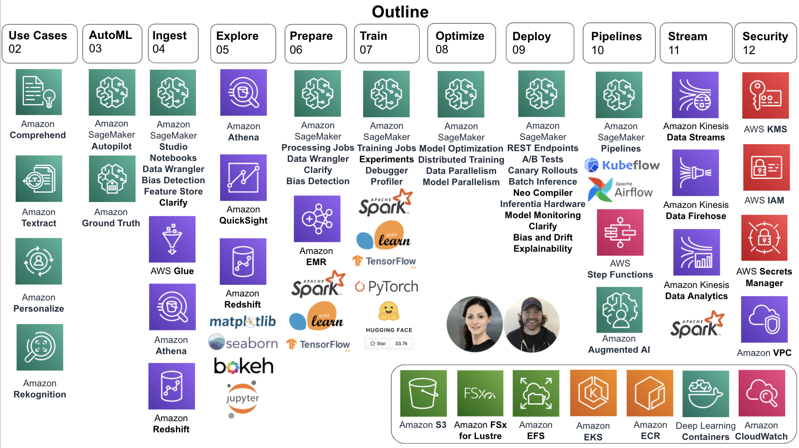

## クイックスタート ワークショップ（3-4時間）

[00_quickstart](./00_quickstart)は、500ページを超える「[実践 AWSデータサイエンス](https://www.oreilly.co.jp/books/9784873119687/)」のコンセプトを、3-4時間程度という超特急で体感できるハンズオンコンテンツです。

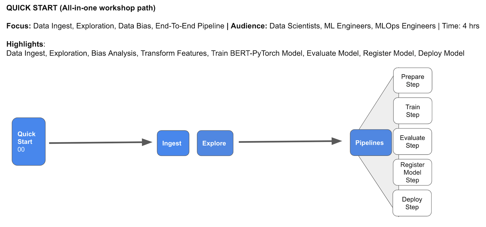

このワークショップでは、Amazon SageMakerを使って自然言語処理（NLP）のワークロードを効率化する、エンドツーエンドのAI/MLパイプラインを構築します。
言語表現の獲得のためには最先端の[BERT](https://arxiv.org/abs/1810.04805)モデルを使用して、商品レビューの星評価（1〜5）を予測するテキスト分類器をトレーニングします。
BERTベースのNLPテキスト分類器を構築するために、[Amazon Customer Reviews Dataset](https://s3.amazonaws.com/amazon-reviews-pds/readme.html)という、商品のレビュー文と星評価（1～5）を含むデータセットを使用します。

### クイックスタート ワークショップで学べること

このハンズオンワークショップを体験することで、次の内容を学ぶことができます。

- Amazon AthenaとParquetデータフォーマットを使用したS3へのデータの取り込み
- SageMakerノートブック上でのPandas、matplotlibによるデータの可視化
- SageMaker Clarifyを使用した統計的データバイアスの検出
- Scikit-Learn および SageMaker Processing Job を使用した、生データセットに対する特徴量エンジニアリングの実行
- SageMaker Feature Store を使用した特徴量の保存と共有
- TensorFlow、Keras、およびSageMakerのトレーニングジョブを使用したカスタムBERTモデルのトレーニングと評価
- SageMaker Processing Job を使用したモデルの評価
- Amazon SageMaker ML Lineage Tracking を使用したモデルアーティファクトの追跡
- SageMaker Clarify を使用したモデルバイアスおよび説明可能性分析の実行
- SageMaker Model Registry を使用したモデルの登録とバージョン管理
- SageMaker Hosting および SageMaker Endpoint を使用した REST エンドポイントへのモデルのデプロイ
- SageMaker Pipelines を使用したエンドツーエンドのモデルパイプライン構築による ML ワークフローステップの自動化

### 前提条件

**このワークショップはバージニア北部（us-east-1）リージョンで実施してください。**
ワークショップ用のカスタマーレビューデータセットが、us-east-1にあるAmazon S3バケットに置かれています。
他の東京リージョンなどで作業すると、Athenaクエリなど実行する際に、レイテンシーが非常に大きくなってしまいます。

また、このワークショップはAmazon SageMaker Studioという、機械学習の統合開発環境で実施することを前提としています。
こちらの[ドキュメント](https://docs.aws.amazon.com/sagemaker/latest/dg/onboard-quick-start.html)や、以下の「ワークショップ開始の手順」を参考に、SageMaker Studioの環境を構築してください。

SageMaker Studioの環境構築時に作成されるSageMaker実行ロール（`AmazonSageMaker-ExecutionRole-***`）にはあらかじめ `AmazonSageMakerFullAccess` のポリシーがアタッチされていますが、さらに `AWSGlueConsoleFullAccess` といったポリシーも追加する必要があることにもご注意ください。ワークショップ中に AWS Glue を用いる箇所があります。（実際の運用時には FullAccess ではなく、最小権限の原則に則り、必要なポリシーのみをアタッチするようにしてください。）

## ワークショップ開始の手順

ここでは、AWSのインストラクター主導のワークショップにご参加の場合の手順を解説します。

### 1. AWSコンソールへログイン

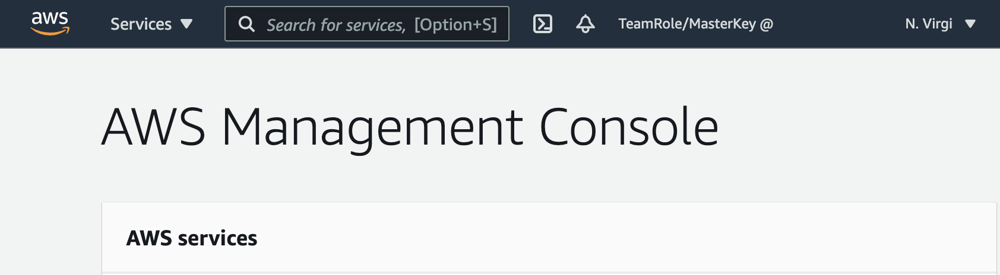

### 2. IAMの設定とSageMaker Studioの起動

SageMaker実行ロールに、ワークショップで必要なIAMポリシーをアタッチしてください。

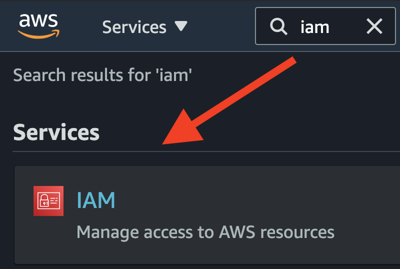

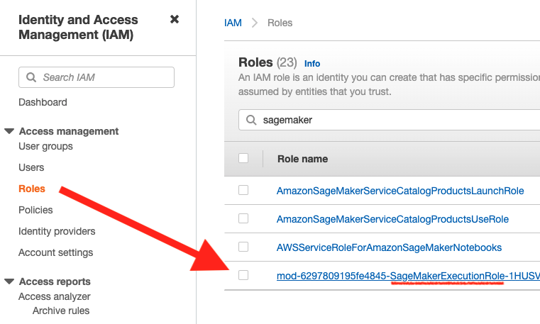

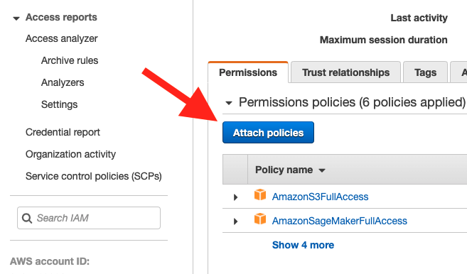
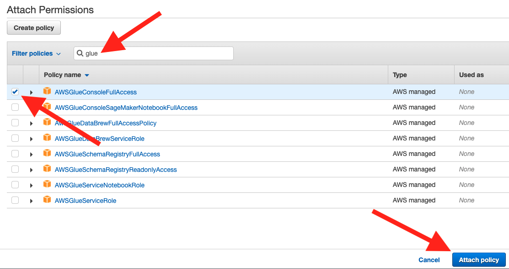

AWSコンソールの検索バーに `SageMaker` と入力し、`Amazon SageMaker` を選択してサービスコンソールを開きます。

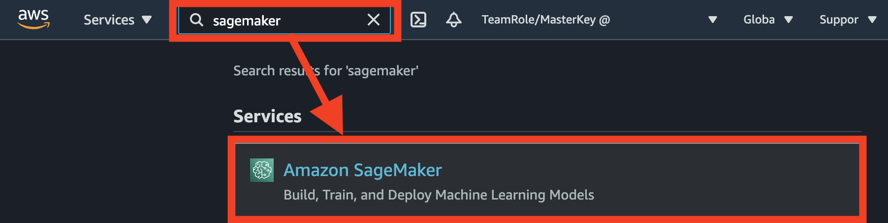

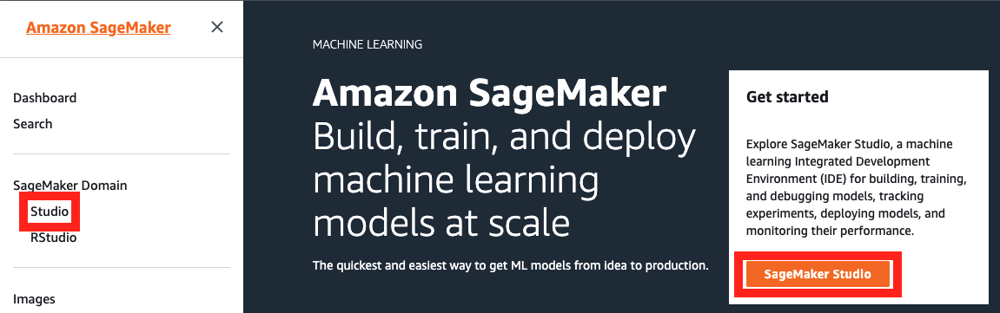

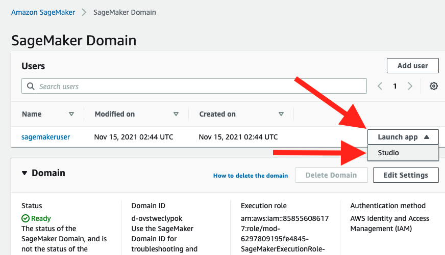

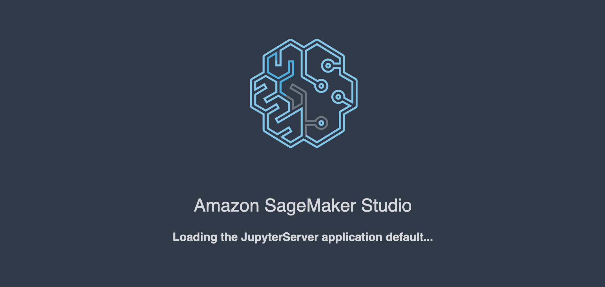

### 3. Studio内で新しいターミナルを起動

`File`→`New`→`Terminal` をクリックして、Jupyterインスタンス上でターミナルを起動します。

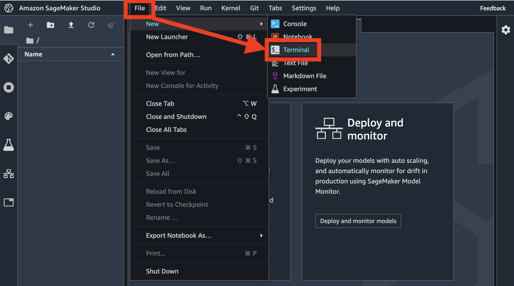

### 4. ターミナルからGitHubリポジトリをクローン

ターミナル内で、以下を実行します。

```
cd ~ && git clone https://github.com/oreilly-japan/data-science-on-aws-jp
```

もし以下のようなエラーが出たら、うまくいくまで再度コマンドを実行してください。

```
fatal: Unable to create '/home/sagemaker-user/data-science-on-aws-jp/.git/index.lock': File exists.

Another git process seems to be running in this repository, e.g.
an editor opened by 'git commit'. Please make sure all processes
are terminated then try again. If it still fails, a git process
may have crashed in this repository earlier:
remove the file manually to continue.
```

注: これは致命的なエラーではありません。動作するまでコマンドを再実行してください。

### 5. ワークショップを始めましょう！

SageMaker Studio で `data-science-on-aws-jp/workshop/00_quickstart/` に移動し、ワークショップを開始してください。

_新しい `data-science-on-aws-jp/` ディレクトリが表示されない場合は、ブラウザを更新する必要があるかもしれません。_

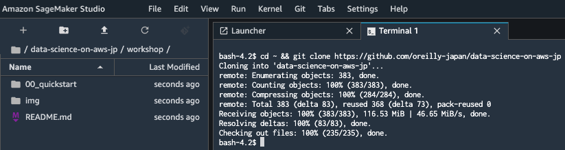